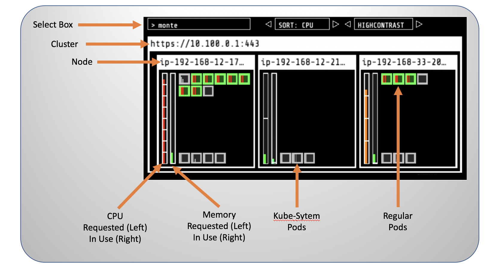
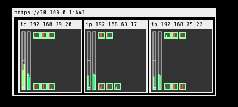

# Auto scaling  

## Kube-ops-view  

`Kube-ops-view` là một template từ `stable` repo, install bằng helm, dùng để visualize trạng thái của cluster hiện tại, các node, pod, cpu, ... các thứ các thứ :v  

  

Lấy link view:  

```bash
kubectl get svc kube-ops-view | tail -n 1 | awk '{ print "Kube-ops-view URL = http://"$4 }'
```

## Metrics server  

Chúng ta cần có cài đặt metric server để có thể tổng hợp các dữ liệu về container CPU, memory, ...  

Install :  

```bash
kubectl apply -f https://github.com/kubernetes-sigs/metrics-server/releases/latest/download/components.yaml
```

Xác thực api endpoint :  

```bash
kubectl get apiservice v1beta1.metrics.k8s.io -o json | jq '.status'
```

## scale an application with HPA  

Horizontal Pod Autoscaler (HPA).  
Chúng ta sẽ triển khai một hệ thống apache server, có thực hiện các tính toán phức tạp để trigger container tăng CPU lên, sau đó sử dụng HPA để thay đổi số lượng pod tùy thuộc vào trạng thái của CPU.  

Đầu tiên, triển khai hệ thống `php-apache`:  

```bash
kubectl create deployment php-apache --image=us.gcr.io/k8s-artifacts-prod/hpa-example
kubectl set resources deploy php-apache --requests=cpu=200m
kubectl expose deploy php-apache --port 80

kubectl get pod -l app=php-apache
```

```php
// index.php
<?php
  $x = 0.0001;
  for ($i = 0; $i <= 1000000; $i++) {
    $x += sqrt($x);
  }
  echo "OK!";
?>
```

Sau đó, chúng ta định nghĩa HPA dựa trên CPU :  

```bash
kubectl autoscale deployment php-apache `#The target average CPU utilization` \
    --cpu-percent=50 \
    --min=1 `#The lower limit for the number of pods that can be set by the autoscaler` \
    --max=10 `#The upper limit for the number of pods that can be set by the autoscaler`
```

Dựa trên trạng thái của CPU, kubelet sẽ điều chỉnh số lượng port thích hợp, min là 1 và max port là 10.  

Dùng lệnh sau để trigger đoạn tính toán trong trang `index.php`:  

```bash
kubectl --generator=run-pod/v1 run -i --tty load-generator --image=busybox /bin/sh -c "while sleep 0.01; do wget -q -O- http://php-apache; done"
```

Câu lệnh trên thực thi tạo 1 pod là `load-generator` rồi thực thi lệnh wget tới trang `index.php`.  

Dùng lệnh `kubectl get hpa -w` để xem workload hiện tại.Theo dõi bên `kube-ops-view` :  

  

Ta thấy trong node 1, cpu đã tăng tới gần 50%.  

```bash
ec2-user:~/environment/liveness-check $ kubectl get hpa -wNAME         REFERENCE               TARGETS   MINPODS   MAXPODS   REPLICAS   AGE
php-apache   Deployment/php-apache   57%/50%   1         10        7          21m
```

HPA sẽ tăng số lượng pod lên cho tới khi lương CPU trung bình nhỏ hơn 50%.  
