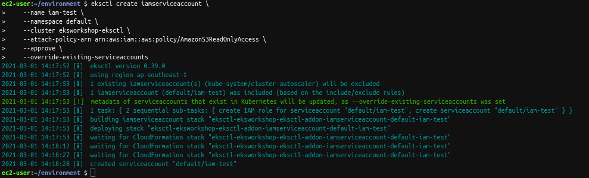
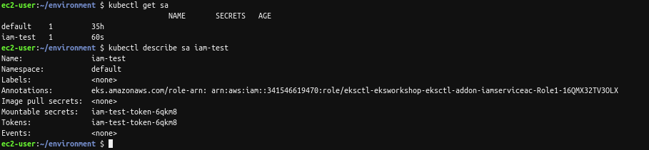

# IAM Roles for Service Accounts  

## Tạo OIDC provider  

```bash
eksctl utils associate-iam-oidc-provider --cluster eksworkshop-eksctl --approve
```

`OIDC` là một bên thứ ba xác thực các thông tin đăng nhập của người dùng. Tương ứng với mỗi cluster cần có một `OIDC`.  

Các tài khoản được tạo trong eks cluster sẽ được lưu định danh thông qua `OIDC`.  

## Tạo role bind cho một tài khoản  

```bash
eksctl create iamserviceaccount \
    --name iam-test \
    --namespace default \
    --cluster eksworkshop-eksctl \
    --attach-policy-arn arn:aws:iam::aws:policy/AmazonS3ReadOnlyAccess \
    --approve \
    --override-existing-serviceaccounts
```

Tạo một tài khoản có tên là `iam-test` trong namespace `default`, có attach policy `S3 readonly`.  

  

  

## Sample app  

+ `job-s3.yaml`:  

```yaml
apiVersion: batch/v1
kind: Job
metadata:
  name: eks-iam-test-s3
spec:
  template:
    metadata:
      labels:
        app: eks-iam-test-s3
    spec:
      serviceAccountName: iam-test
      containers:
      - name: eks-iam-test
        image: amazon/aws-cli:latest
        args: ["s3", "ls"]
      restartPolicy: Never
```

Job trên tạo một container từ image `amazon/aws-cli:latest` để thực thi command `s3 ls`, dưới quyền của service account `iam-test`.  
Như bên trên, chúng ta đã cấp quyền cho account `iam-test` được quyền đọc, vậy nên lệnh này sẽ thành công.  
