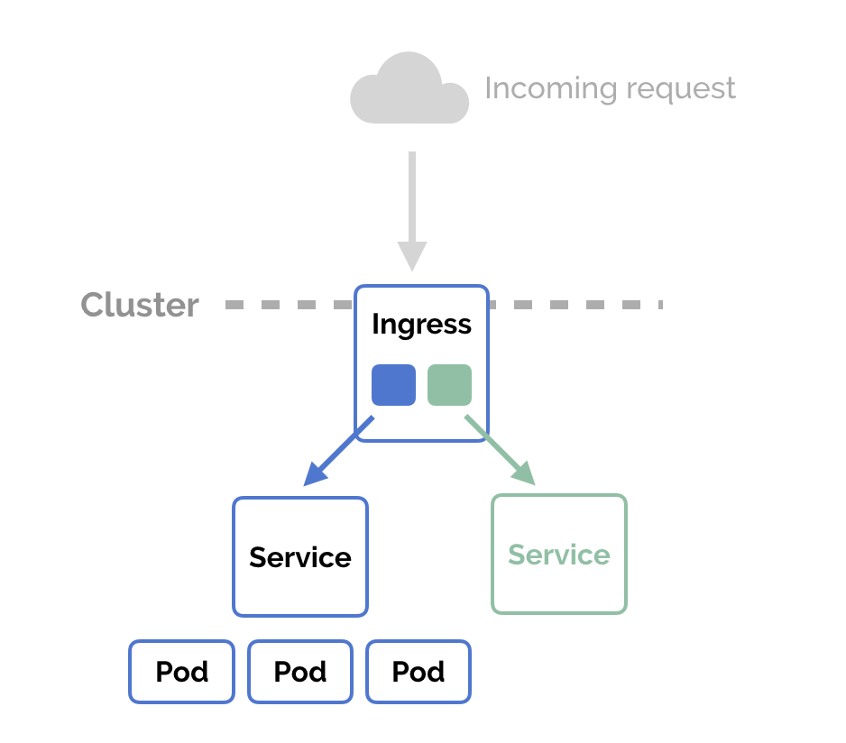
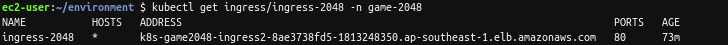
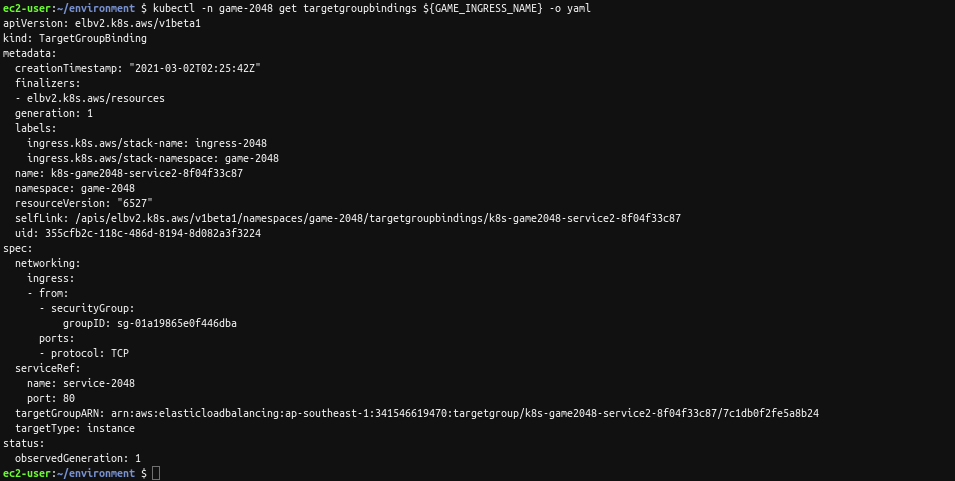
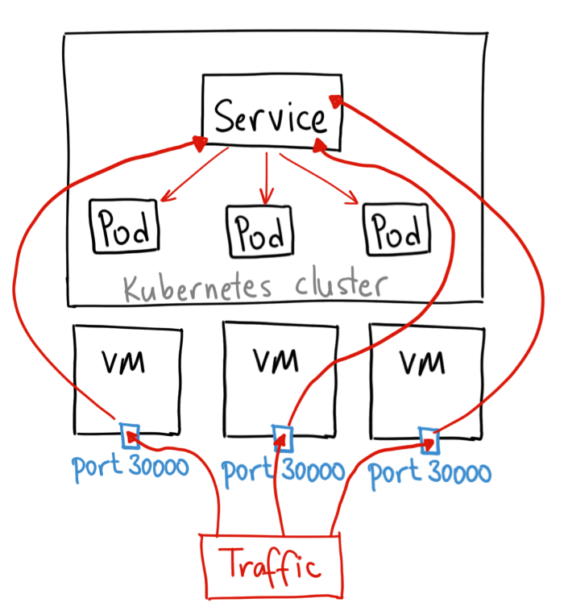
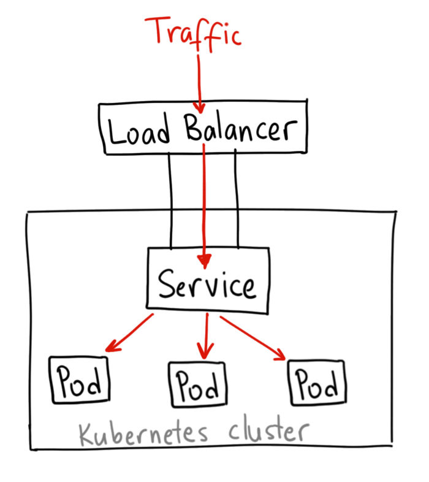

# Ingress to expose deployment  

Ingress là thành phần dùng để điều hướng các gói tin từ bên ngoài vào các dịch vụ bên trong cluster.  

  

Để ingress có thể hoạt động được thì tùy từng ứng dụng mà chúng ta cần phải cài đặt các `Ingress controller` tương ứng.  

## Install ingress controller for EKS  

### Create service account  

+ Enable oidc provider :  

```bash
eksctl utils associate-iam-oidc-provider \
    --region ${AWS_REGION} \
    --cluster eksworkshop-eksctl \
    --approve
```

+ Create iam policy for service account:  

```bash
aws iam create-policy \
    --policy-name AWSLoadBalancerControllerIAMPolicy \
    --policy-document https://raw.githubusercontent.com/kubernetes-sigs/aws-load-balancer-controller/main/docs/install/iam_policy.json
```

+ Create iam role and service accout:  

```bash
eksctl create iamserviceaccount \
  --cluster eksworkshop-eksctl \
  --namespace kube-system \
  --name aws-load-balancer-controller \
  --attach-policy-arn arn:aws:iam::${ACCOUNT_ID}:policy/AWSLoadBalancerControllerIAMPolicy \
  --override-existing-serviceaccounts \
  --approve
```

### Install TargetGroupBinding CRDs  

[TargetGroupBinding](https://kubernetes-sigs.github.io/aws-load-balancer-controller/guide/targetgroupbinding/targetgroupbinding/) là một custom resource dùng để expose các pod trong 1 target group.  

```bash
kubectl apply -k github.com/aws/eks-charts/stable/aws-load-balancer-controller/crds?ref=master

kubectl get crd
```

### Deploy helm chart  

```bash
helm repo add eks https://aws.github.io/eks-charts

helm upgrade -i aws-load-balancer-controller \
    eks/aws-load-balancer-controller \
    -n kube-system \
    --set clusterName=eksworkshop-eksctl \
    --set serviceAccount.create=false \
    --set serviceAccount.name=aws-load-balancer-controller \
    --set image.tag="${LBC_VERSION}"

kubectl -n kube-system rollout status deployment aws-load-balancer-controller
```

Cài đặt `aws-load-balancer-controller` từ helm với service account được tạo từ bước trước.  

## Deploy sample application  

```bash
curl -s https://raw.githubusercontent.com/kubernetes-sigs/aws-load-balancer-controller/main/docs/examples/2048/2048_full.yaml \
    | sed 's=alb.ingress.kubernetes.io/target-type: ip=alb.ingress.kubernetes.io/target-type: instance=g' \
    | kubectl apply -f -
```

Phân tích ingress resource:  

```yaml
apiVersion: extensions/v1beta1
kind: Ingress
metadata:
  namespace: game-2048
  name: ingress-2048
  annotations:
    kubernetes.io/ingress.class: alb
    alb.ingress.kubernetes.io/scheme: internet-facing
    alb.ingress.kubernetes.io/target-type: ip
spec:
  rules:
    - http:
        paths:
          - path: /*
            backend:
              serviceName: service-2048
              servicePort: 80
```

+ Ingress resource trên sẽ redirect toàn bộ http request có path `/` tới service `service-2048` qua cổng 80.  
+ `host`: optional, nếu không có sẽ xử lý toàn bộ request http tới, nếu chỉ định (vd : foo.com) thì chỉ xử lí request tới host đó.  
+ backend: chỉ đinh service  

Kiểm tra ingress đã được chưa :  

```bash
kubectl get ingress/ingress-2048 -n game-2048
```

Chúng ta sẽ thu được address host :  

  

Xem chi tiết về ingress thông qua `targetgroupbindings`:  

```bash
export GAME_INGRESS_NAME=$(kubectl -n game-2048 get targetgroupbindings -o jsonpath='{.items[].metadata.name}')

kubectl -n game-2048 get targetgroupbindings ${GAME_INGRESS_NAME} -o yaml
```

  

  

## NodePort vs LoadBalancer vs Ingress  

[ref](https://medium.com/google-cloud/kubernetes-nodeport-vs-loadbalancer-vs-ingress-when-should-i-use-what-922f010849e0)  

+ Nodeport dùng cho expose service, bằng cách mở một port trên các node/vm :  

  

Sau đó thông qua service để điều hướng các request, tuy nhiên có một nhược điểm là khi các Node/Vm thay đổi Ip thì ứng dụng sẽ không truy cập được. Vì vậy dùng cho trường hợp ứng dụng không cần lúc nào cũng khả dụng.

+ LoadBalancer:  

  

Dùng `LoadBalancer` để điều hướng tất cả các loại request, từ HTTP, HTTPS, TCP, UDP, ... Tuy nhiên với mỗi ứng dụng cần có một load balancer nên sẽ tiêu tốn tiền :)  

+ Ingress:  

Cấu hình phức tạp hơn, có nhiều loại ingress với cách dùng khác nhau, chỉ cần 1 loadbalancer cho nhiều ứng dụng khác nhau, tuy chỉnh theo tên miền của Loadbalancer.  


## Ref  

+ <https://kubernetes-sigs.github.io/aws-load-balancer-controller/guide/ingress/annotations/>  
